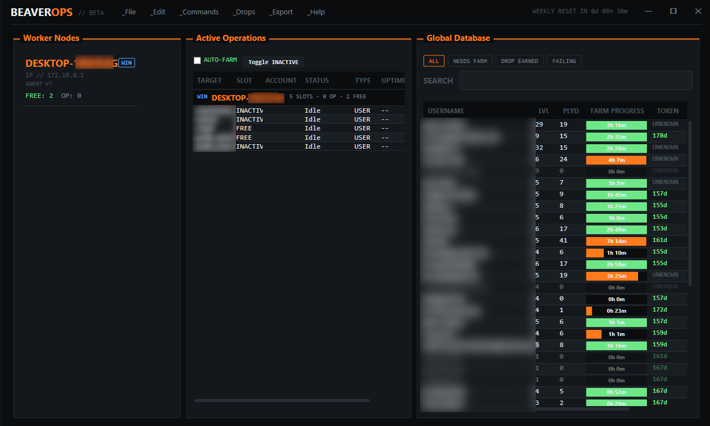
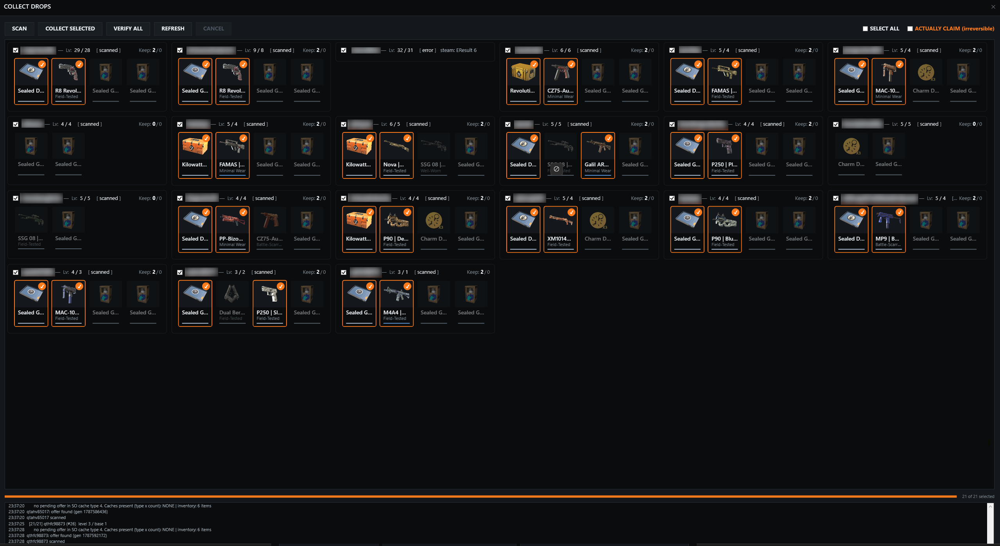
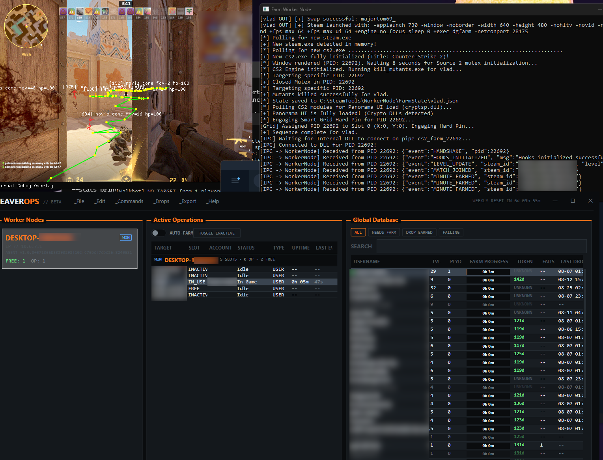
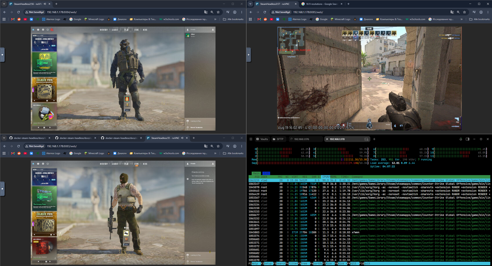
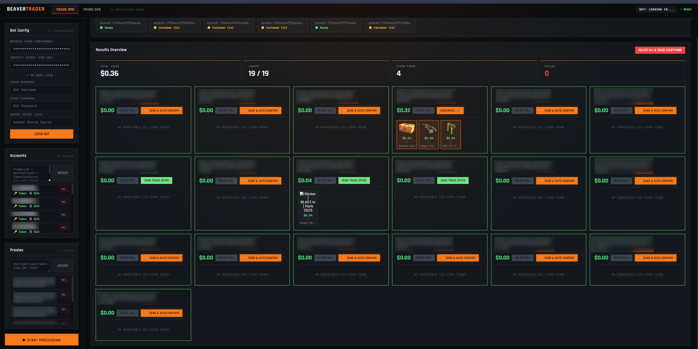

# BeaverOps

> Automated distributed operations framework for Counter-Strike 2 weekly drop farming, multi-instance worker management, and Steam trading liquidation.

---

## Overview

**BeaverOps** is an end-to-end automation suite designed to streamline large-scale Counter-Strike 2 weekly drop operations. It ties together central fleet management, multi-instance game execution, automated weekly drop claiming, and proxy-routed trade consolidation into a single coordinated pipeline.

## System Showcase

### 01. Master Node & Operations Dashboard

The central command center for managing the account fleet, tracking farming progress, and dispatching tasks across worker machines.

- **Worker Pool Management**: Real-time discovery and health tracking of connected worker nodes.
- **Account Database**: Fleet-wide roster with live weekly XP/drop progress bars, playtime tracking, and login token expirations.
- **Auto-Farm Scheduler**: One-click parallel slot control with automatic weekly drop reset synchronization.

---

### 02. Collect Drops Verification & Claim Console

An internal harvester module that inspects, validates, and claims weekly drop rewards across accounts without opening the game client.

- **Batch Scanner**: One-click fleet scan discovering pending weekly drop packages.
- **Smart 2-Item Selection**: Automatically prioritizes high-value weapon cases (Kilowatt, Revolution, etc.) and weapon finishes over graffiti.
- **Irreversible Claim Protection**: Safeguarded batch confirmation with live SO cache transaction logging.

---

### 03. Worker Node Execution Engine

#### Stable Production (Windows)
Runs multiple concurrent CS2 sessions on Windows by assigning accounts to separate Windows local user accounts and closing Source 2 mutant handles (`kill_mutants.exe`) in process memory.

- **Process & Mutex Isolation**: Bypasses single-instance locks on Windows using local account switching and mutant handle termination.
- **Named Pipe IPC**: Sending structured game lifecycle events (`HANDSHAKE`, `HOOKS_INITIALIZED`, `MATCH_JOINED`, `MINUTE_FARMED`).
- **Smart Grid Hard Pin**: Automatically locks game windows to specific screen grid slots with real-time in-game navigation and raycast pathing overlays.

#### Experimental Branch (Headless Linux Docker)
Experimental Linux cluster running 3 concurrent CS2 sessions inside isolated Docker containers (`docker-steam-headless`) with noVNC browser viewports and `htop` thread telemetry.

---

### 04. BeaverTrader Automated Liquidation Panel

Dedicated trade management console for consolidating harvested cases and skins from farm accounts to storage accounts.

- **SDA & 2FA Automation**: Native Steam Desktop Authenticator integration with Base64 shared secrets and refresh tokens.
- **SOCKS5 Proxy Rotation**: Live rotating proxy pool with cooldown health checks to bypass Steam rate limits.
- **One-Click Consolidation**: Automated trade offer generation and auto-confirmation dispatch with real-time inventory valuations.

---

<!-- ## Tech Stack

- **Web Dashboard**: [Go](https://go.dev/) (1.24) + [Templ](https://templ.guide/) + Dark Tactical CSS
- **Game Automation**: Steam CLI parameters, Mutex Handle Termination, Named Pipe IPC, Smart Grid
- **Trading & Network**: Steam Desktop Authenticator (SDA), SOCKS5 Proxy Network
- **Infrastructure**: Windows (Stable Production) & Docker Steam Headless (Experimental Linux)

--- -->

The web dashboard will be available at `http://localhost:1337/`.
